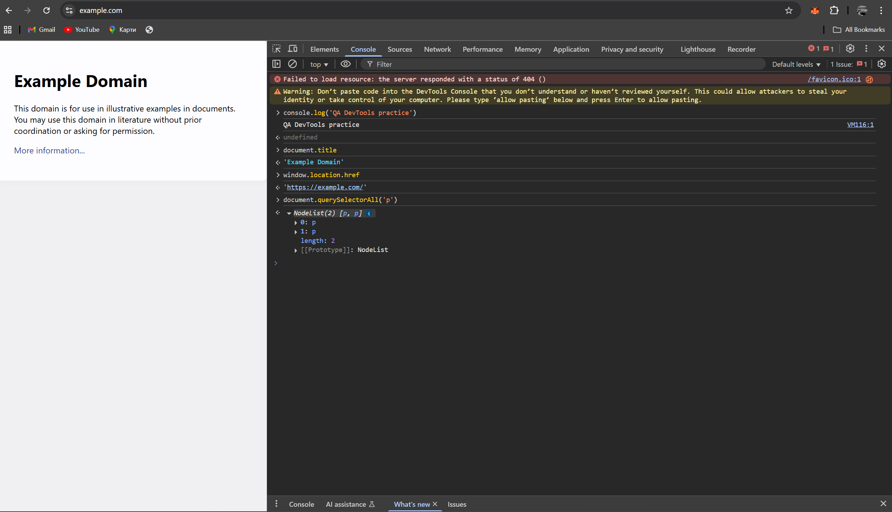

# DevTools Practice Log

## Session Information

**Date:** October 2, 2025  
**Website Used:** https://example.com  
**Browser:** Google Chrome  
**DevTools Version:** Latest

---

## Commands Tested

### 1. Console Log Practice

**Command:**

```bash
console.log('QA DevTools practice')
```

**Result:**

```bash
QA DevTools practice
```

**Description:** Successfully logged a custom message to the console. This command is fundamental for debugging and outputting information during test execution.

---

### 2. Get Page Title

**Command:**

```bash
document.title
```

**Result:**

```bash
'Example Domain'
```

**Description:** Retrieved the current page title. This is useful for verifying that the correct page has loaded during automated tests.

---

### 3. Get Current URL

**Command:**

```bash
window.location.href
```

**Result:**

```bash
'https://example.com/'
```

**Description:** Obtained the full URL of the current page. Essential for URL validation and navigation verification in test scenarios.

---

### 4. Query All Paragraph Elements

**Command:**

```bash
document.querySelectorAll('p')
```

**Result:**

```bash
NodeList(2) [p, p]
0: p
1: p
length: 2
[[Prototype]]: NodeList
```

**Description:** Found 2 paragraph elements on the page. This command demonstrates how to locate and count specific HTML elements, which is crucial for element verification in automated testing.

---

## How This Helps Future Testing Work

1. **Console Accessibility:** The DevTools Console provides immediate feedback for JavaScript commands
2. **DOM Interaction:** Commands like `document.querySelectorAll()` allow direct interaction with page elements
3. **Data Types:** Different commands return different data types (strings, NodeLists, etc.)
4. **Real-time Execution:** All commands execute immediately in the browser context

---

## Screenshot



_Screenshot showing all executed commands and their results in the Chrome DevTools Console_

---
